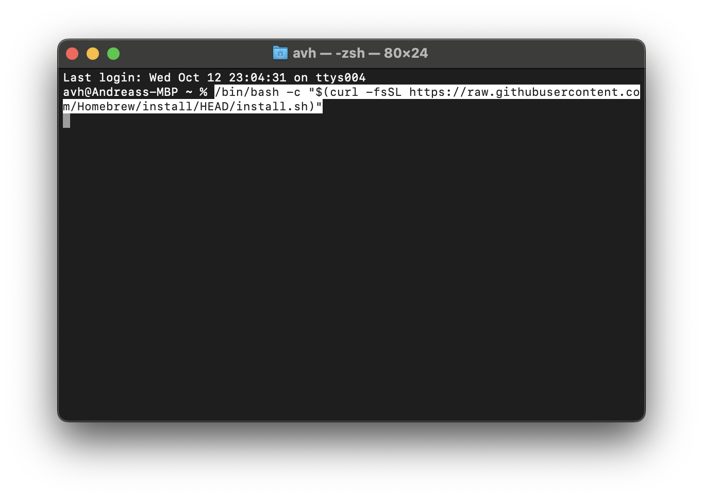
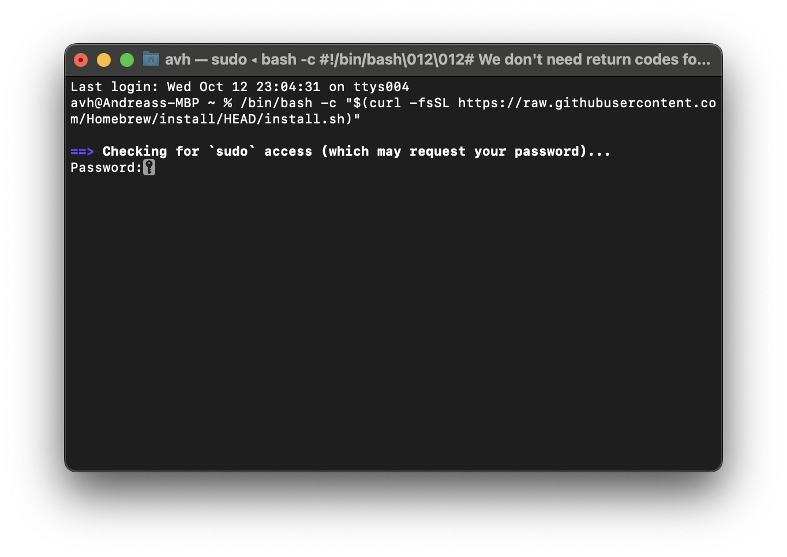
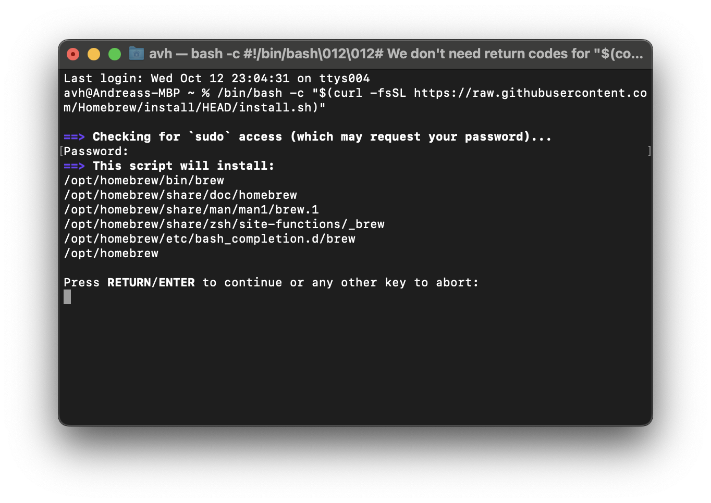
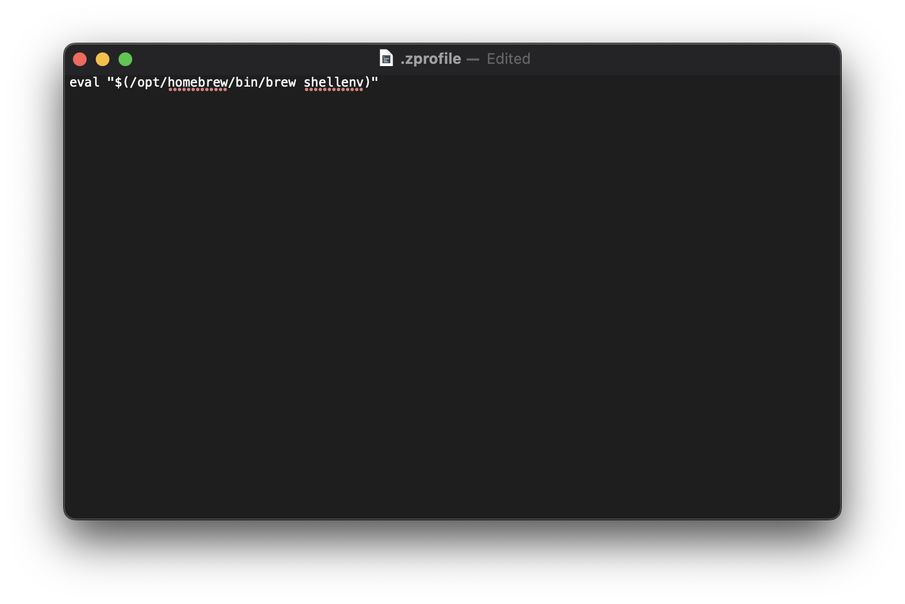

# Python Demo-Projekt für WIB Workshop
27.10.2022, Andreas von Haaren


## Installationsanleitung

Viele (eigentlich alle) der folgenden Schritte müssen aus einem Terminal ausgeführt werden. Wenn Du vorher noch nie mit einem Terminal gearbeitet hast, keine Sorge, das kriegen wir hin!

Alles, was Du installierst, ist zusammen ca. 5GB groß. So viel Speicher wirst Du also mindestens brauchen.
Es gibt am Ende eine Anleitung zum Deinstallieren, wenn Du alles wieder loswerden willst, was Du für den Workshop installiert hast.

### macOS

*Du kannst ein Terminal öffnen, indem Du Cmd+Leertaste drückst, dann Terminal eingibst und Enter drückst. Das sieht dann ungefähr so aus:*


#### 1. Installation von Homebrew  
   Homebrew ist ein sogenannter Package Manager. Damit kann man viele Programme einfach vom Terminal aus installieren und muss sich nicht Gedanken darum machen, wo man bspw eine .dmg oder .pkg Datei herunterlädt, man muss sich nicht durch einen Installer kämpfen, und man muss keine Programme selbst in den Applications Ordner verschieben. Noch viel besser: Wenn man ein Programm wieder deinstallieren will, ist das in einem Befehl erledigt!  
   
   Um homebrew zu installieren, musst Du nur diesen Befehl kopieren und in das Terminal einfügen und dann mit Enter bestätigen.
   ```
   /bin/bash -c "$(curl -fsSL https://raw.githubusercontent.com/Homebrew/install/HEAD/install.sh)"
   ```
   
   Um die Installation durchzuführen, musst Du Dein Benutzerpasswort eingeben und mit Enter bestätigen:
   
   *Hinweis: wenn Du hier etwas eingibst, wird man das nicht sehen, es gibt keine **** oder ähnliches*  
   Jetzt noch einmal mit Enter bestätigen
   
   Das Skript wird Dich gegebenenfalls ab und zu um Bestätigung bitten. Die Entwickler von Homebrew sind extrem gründlich, daher befolge bitte alle Anweisungen, die Dir gestellt werden.
   Wenn die Installation abgeschlossen ist, steht unten im Terminal wieder
   ```
   dein-benutzername@Dein-MBP ~ % 
   ```
   Jetzt kannst du das Terminal Fenster schließen und ein neues öffnen, damit die geänderten Einstellungen übernommen werden.
   Wenn alles geklappt hat, müsste der Command
   ```
   brew --version
   ```
   dir die installierte Version von Homebrew anzeigen.

#### 2. Installation von Python und Visual Studio Code
   Jetzt können wir Python und den Code Editor, den wir für den Workshop benutzen, herunterladen und installieren.
   Führe dazu den Befehl
   ```
   brew install python visual-studio-code
   ```
   aus.

1. Install pyenv and Visual Studio Code
2. Install Python using pyenv
3. Install poetry
4. Clone this repository

Note: The | character on a German mac keyboard can be accessed using Alt+7

### Windows

1. Install Visual Studio Code
2. Install pyenv-win
3. Install poetry
4. Clone this repository


## Deinstallation

### macOS

#### Python, VSCode und Homebrew
Die Deinstallation ist sehr einfach:
Führe einfach die folgenden Kommandos hintereinander aus:

```
brew uninstall python visual-studio-code
/bin/bash -c "$(curl -fsSL https://raw.githubusercontent.com/Homebrew/install/HEAD/uninstall.sh)"
```
Das zweite Skript deinstalliert homebrew. Wenn das Skript fertig ist, werden einige Ordner aufgelistet, die Du gegebenenfalls noch manuell löschen musst. Dazu kannst du beispielsweise in einem Finder Fenster Shift+Cmd+G drücken und dann den übergeordneten Ordner eingeben, um dann von dort alles weitere zu löschen.

Je nachdem, auf welcher Version von macOS Du bist, musst Du auch noch eine Einstellung für das Terminal ändern. Auf einem neuen MacBook mit Apple Silicon kannst Du dazu in einem Terminal
```
open .zprofile
```
eingeben.
Dann öffnet sich der default Text Editor von macOS, textedit:

Die Zeile mit "brew shellenv" musst Du löschen, dann speichern und das Fenster schließen.

#### XCode Command Line Tools
Die offizielle Dokumentation von Apple sagt, dass man einfach den Ordner löschen soll, wo diese installiert sind. Öffne dazu im Finder den Ordner "/Library/Developer" und lösche dort den Ordner "CommandLineTools". Gegebenenfalls musst Du dein Passwort eingeben.


#### Fertig 🎉